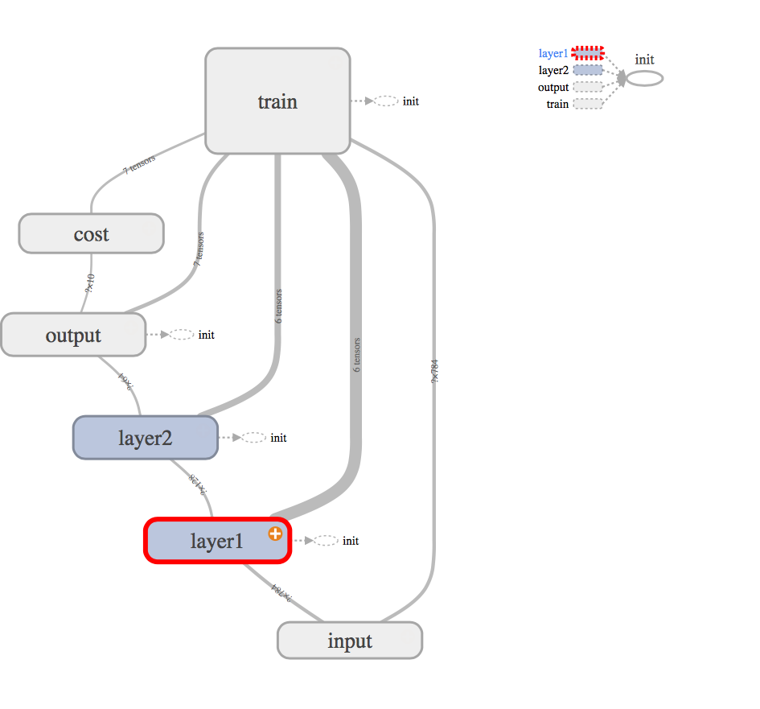
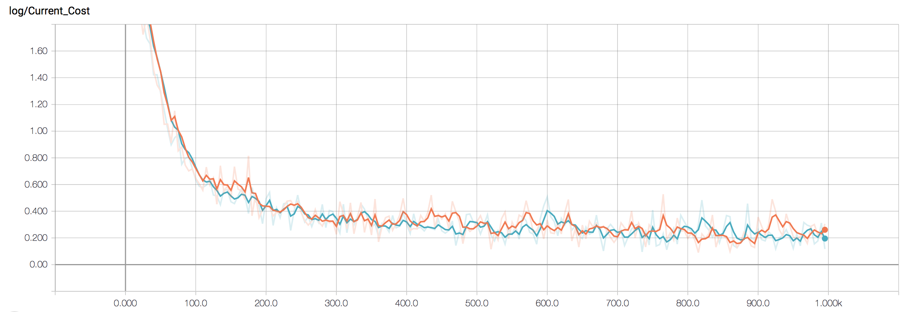
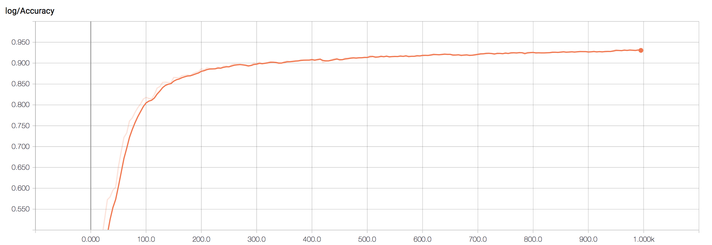

# BasicTensorflow

Based on Lynda Course and Tensorflow introduction and
TensorFlow Tutorials by Hvass-lab

## Simple Feed Forward
has 2 layers with 128 and 64 neurons respectively.

## Cost of the SimpleFeedForward

## Accuracy of the SimpleFeedForward

